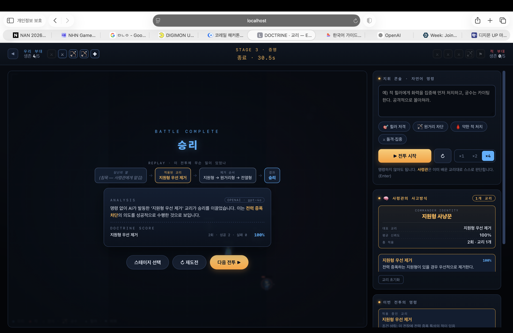

<div align="center">

# DOCTRINE · 교리

### *Every order becomes a doctrine.*

**플레이어는 병사를 성장시키지 않는다. AI 사령관의 사고방식을 성장시킨다.**




<sub>STAGE 3 — 플레이어는 <b>침묵</b>했다. 사령관이 스스로 「지원형 우선 제거」 교리를 발동해 승리. 명령 없이, GPT-4o의 분석과 함께.</sub>

NAN 2026 · NHN 게임 × AI 해커톤 예선 프로토타입

</div>

---

## Why?

기존 RTS는 명령이 곧 행동이고, 전투가 끝나면 사라진다.
**DOCTRINE**에서 명령은 사라지지 않는다 — AI 사령관이 그 명령의 **의도**를 추론하고,
유닛 이름이 아니라 **역할군(원리)** 수준으로 일반화해 **영구적인 전술 교리**로 저장한다.
그 교리는 다음 전투에서 **플레이어가 아무 말도 하지 않아도** 스스로 적용된다.

### 왜 LLM이 아니면 안 되는가

사람은 사전에 있는 말로 말하지 않는다. 아래는 **실제 측정값**이다.

| 플레이어 입력 | Rule-based | LLM (GPT-4o) |
|---|:---:|:---:|
| "적 힐러에게 화력을 집중해라" | ✅ | ✅ |
| "쟤 하나 때문에 안 죽잖아" | ❌ | ✅ `support` |
| "뒤에 깃발 든 애 거슬려" | ❌ | ✅ `support` |
| "뒤부터 죽여" | ❌ | ✅ `ranged` |
| "안녕하세요" | ❌ | ❌ *(이해 못 함)* |

정규식은 사전에 있는 표현만 잡는다. LLM은 임의의 자연어에서 의도를 읽고, 없는 의도는 지어내지 않는다.

---

## Architecture

```
   Player Prompt   →   Intent Extraction   →   Doctrine Generator   →   Doctrine Memory
   "쟤 하나 때문에…"      /api/intent             /api/doctrine            localStorage
                        targetRole: support     원리로 일반화 + 예외      다음 전투 자동 적용
```

출력은 `json_schema`(strict)로 게임이 아는 role·trait enum에 제약된다 —
LLM은 게임 규칙을 지어내지 못하고, 오직 **의도 해석**만 담당한다.
키가 없으면 규칙 기반 폴백으로 자동 강등되며, 화면에 추론 백엔드를 항상 표시한다(`OPENAI · gpt-4o` / `LOCAL · 규칙 기반`).

---

## Run

```bash
# LLM 추론 (기본)
OPENAI_API_KEY=sk-... node server/proxy.js     # → http://localhost:8731

# 키 없이 (규칙 기반 폴백)
python3 -m http.server 8731
```

의존성 0. `node scripts/proof.js`로 회귀 테스트(30/30) 검증. **API 키는 서버에만 존재한다.**

---

## 문서

- [게임 소개 및 설명 문서](docs/DOCTRINE_게임소개서.pdf)
- [AI 활용 기술 문서 — 왜 LLM이 아니면 안 되는가](docs/DOCTRINE_AI활용기술문서.pdf)
- [포트폴리오 · 참고자료 — 설계 여정 · 로드맵](docs/DOCTRINE_포트폴리오.pdf)

---

> **This project does not use AI to replace the player.
> It uses AI to remember, generalize, and evolve the player's strategy.**

## License

MIT
